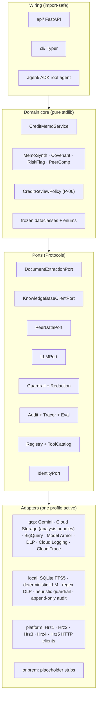
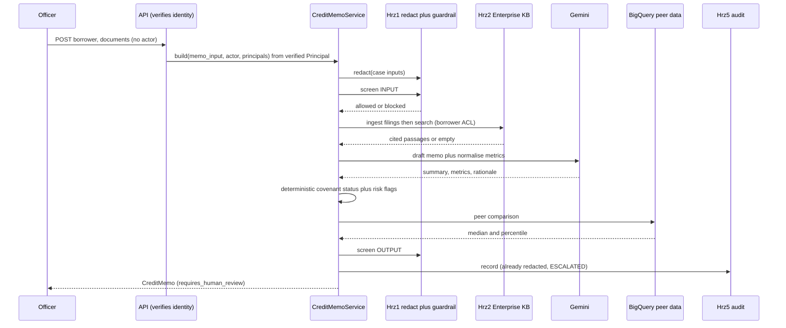
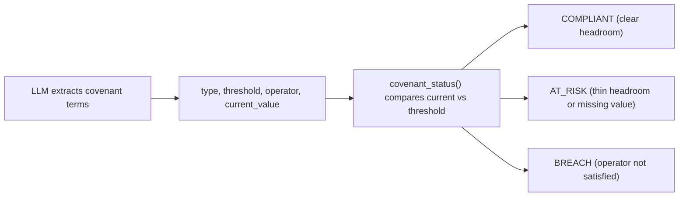

# Architecture: Doc2 Credit-Memo / Underwriting Assistant

Doc2 is a hexagonal (ports-and-adapters) application. A pure-stdlib domain core orchestrates
the credit-memo build; every external capability is reached through a `Protocol` port bound
to one of four adapter families (`gcp`, `local`, `platform`, `onprem`) by a single profile
switch. This document covers the layering, the safety pipeline, the deterministic covenant
rule, and two reusable principle catalogues (section 6 portability, section 7 security)
written so other projects can lift the patterns: each principle states the rule generically,
how this repo implements it, and the command that proves it.

## 1. Layering



The domain core imports nothing from `google-cloud`, ADK, FastAPI, httpx or pydantic. The
wiring layers build a `Container` (config.py) that lazily binds each port to its adapter, so
importing the API, CLI or agent never pulls in a Google Cloud SDK. The `local` profile binds
the offline `adapters/local` family and is the dev/test default: it runs the whole memo
pipeline end to end with no cloud, no API key and no emulator (SQLite FTS5 retrieval, a
deterministic schema-driven LLM, regex DLP, a heuristic guardrail, an append-only local
audit, and in-process registry / tool-catalog / eval).

## 2. The build pipeline (R1 full safety)



A blocked input writes a BLOCKED audit record and raises (no partial memo). An empty
retrieval after ingestion raises (a memo is never built on absent evidence). Both the
prompt and the response are screened, and only already-redacted text reaches the audit sink
or a trace span (message-content capture is off).

## 3. The deterministic covenant rule



`_grounded.covenant_status(current_value, threshold, operator)` is the single, auditable
place where compliance is decided. The LLM only extracts the terms; it can never declare a
covenant met or breached. A BREACH escalates the memo to enhanced review.

## 4. Profiles and reversibility

| Concern | gcp | local | platform | onprem |
| --- | --- | --- | --- | --- |
| Extraction | local parser (pypdf/text) | local parser (pypdf/text) | n/a | placeholder |
| Governed RAG | per-request SQLite FTS5 | SQLite FTS5 (BM25) | Hrz2 KB | placeholder |
| Analysis custody | regional CMEK bucket (15-day lifecycle) | directory | regional CMEK bucket | placeholder |
| Peer data | BigQuery | in-process peer table | n/a | placeholder |
| LLM | Gemini | deterministic schema-driven | n/a | placeholder |
| Guardrail + redaction | Model Armor + DLP | heuristic + regex | Hrz1 gateway | placeholder |
| Audit + tracing | Cloud Logging + Cloud Trace | append-only SQLite + no-op | Hrz5 | placeholder |
| Eval gate | Gen AI eval | in-repo offline gate | Hrz4 | placeholder |
| Registry + tools | A2A card + MCP | in-process | Hrz3 | placeholder |
| Identity | IAP assertion verify | seeded dev personas | IAP assertion verify | placeholder |

The `local` family is a set of real, deterministic, SDK-free adapters: it proves the domain
runs entirely off-cloud (the dev/test default and the offline eval gate run on it). Under
`local` the platform-client ports use in-process implementations, not HTTP to siblings; the
stores can optionally route to Google's official emulators when a `*_EMULATOR_HOST` env var
is set (opt-in, lazy import).

The `onprem` family is a set of structural placeholders that construct cleanly with no
external dependency and raise `NotImplementedError` from each method. The contract test
proves both families satisfy every port Protocol (local answers in-process, onprem fails
fast), so a sovereign migration is "fill in the bodies", not "rewrite the domain"
(P-02, P-12).

## 5. Residency and audit

Every managed resource is provisioned in `asia-southeast1` (see `infra/terraform`). Audit
records are written to Cloud Logging at the project's own retention. A locked ~7-year
WORM bucket was removed deliberately: it would have outlived by a factor of a hundred and
seventy the analyses it describes, whose evidence this deployment deletes after fifteen
days. An adopter running this as a system of record restores it and raises the retention
window together.
Peer data and borrower filings stay in-region; CMEK is applied to the peer dataset and the
log bucket.

## 6. Portability principles (a reusable catalogue)

Portability here means lock-in converted from an open-ended exposure into a priced,
controlled risk. It has to hold at three layers: compute (where the decision logic runs),
data (records, evidence, audit trails), and experience/identity (where users reach the
system and how they sign in). Each principle below is stated generically (steal it), then
grounded in this repo (mechanism plus proof). The one-command version of this whole section
is the offline portability tour:

```bash
PYTHONPATH=src CREDIT_MEMO_PROFILE=local python scripts/portability_demo.py    # exit 0 only if every claim holds
```

Not applicable in this repo (stated here so the catalogue cross-references cleanly with the
[Doc1 reference](../cdd-sow-research/ARCHITECTURE.md)): **PT-10** (the local audit sink is
an append-only stand-in serialized to open JSON, but it does not implement a per-record
cryptographic hash chain or a `verify`/`export`/`restore` CLI, so there is no tamper-evidence
proof to show); **PT-13** (the infra is deliberately single-tenant: [`variables.tf`](infra/terraform/variables.tf)
declares only `project_id` and a few org/billing/toggle values as variables and pins every
service identifier, template name and location to a concrete in-region value, so "a second
enterprise is a tfvars file" is not this repo's design).

### 6.1 Compute layer

| # | Principle (generic) | Mechanism in this repo | Proof |
|---|---------------------|------------------------|-------|
| PT-1 | **Pure decision core.** The domain imports nothing from any vendor: no cloud SDK, no web framework, not even the config parser. Everything external is a narrow interface. | [`domain/`](src/credit_memo/domain/) is stdlib-only; the 12 interfaces live in [`ports/`](src/credit_memo/ports/) as `@runtime_checkable typing.Protocol`s. | `grep -rE "google\|fastapi\|httpx\|pydantic\|yaml" src/credit_memo/domain/` returns nothing. |
| PT-2 | **One construction convention, config-driven binding.** Every adapter is built the same way from one settings object, and the port-to-adapter wiring is data (a config file), not code. Swapping vendors is an edit to config, reviewable in a diff. | `Adapter(settings: Settings)` for every adapter; dotted-path bindings under `adapters:` in [`config/settings.yaml`](config/settings.yaml); the `Container` in [`config.py`](src/credit_memo/config.py) resolves them lazily, one `cached_property` per port. | `pytest tests/contract/test_port_parity.py::test_adapter_constructs_with_single_settings_arg -q` |
| PT-3 | **A profile swaps the whole stack.** One environment variable selects a coherent adapter family for every port at once. | `CREDIT_MEMO_PROFILE` = `gcp` \| `local` \| `platform` \| `onprem`; `Container._bind` in [`config.py`](src/credit_memo/config.py) resolves the active profile's binding (the `local` and `onprem` families are complete, so neither falls back to a managed adapter). | Act 1 of the tour; `tests/contract/test_behavioral_parity.py::test_full_pipeline_local_works_onprem_fails_fast`. |
| PT-4 | **Vendor imports are lazy.** SDK imports live inside methods or `TYPE_CHECKING`, never at module top level, so every module imports on a machine with no vendor packages installed. | All [`adapters/gcp/*`](src/credit_memo/adapters/gcp/) and [`agent/*`](src/credit_memo/agent/) Google imports are in-method; the GCP SDKs live in the optional `[gcp]` extra ([`pyproject.toml`](pyproject.toml)). | The whole gate runs in a venv with only `[dev]` installed; `pytest tests/unit/test_serialization_config_policy.py::test_container_binds_onprem_adapters_without_gcp_sdk -q`. |
| PT-5 | **The offline profile WORKS: it is not a mock.** Ship a real, deterministic, in-process implementation of every port (embedded index, schema-driven LLM stand-in, heuristic guardrail, regex redaction, append-only audit). Make it the default for dev, tests and CI so it can never rot. | The `local` family: SQLite FTS5 KB ([`local/knowledge_base.py`](src/credit_memo/adapters/local/knowledge_base.py)), deterministic LLM, heuristic guardrail, regex DLP, append-only SQLite audit. An unset `CREDIT_MEMO_PROFILE` still binds the `local` adapters, but as an UNCONSENTED run: the seeded no-auth personas and the localhost CORS fallback are refused until a profile is named deliberately (`tests/unit/test_profile_single_source.py`). | `CREDIT_MEMO_PROFILE=local credit-memo build "Acme Holdings Pte Ltd (FICTIONAL)" --sector logistics` prints a cited memo with no cloud. |
| PT-6 | **The exit target exists on day one, as a fail-fast placeholder.** Stubs that construct cleanly, satisfy every interface and raise on use keep the migration honest: interface drift breaks CI, and nothing can silently return a wrong answer. | [`adapters/onprem/*`](src/credit_memo/adapters/onprem/) raise `NotImplementedError`; the CLI maps it to exit 2 with the migration note ([`cli/main.py`](src/credit_memo/cli/main.py)); [`docs/onprem-migration.md`](docs/onprem-migration.md) is the checklist. | `pytest tests/contract/test_port_parity.py -q` (`test_onprem_extraction_fails_fast`). |
| PT-7 | **Parity is tested behaviorally, not just structurally.** "Implements the interface" is weak; put the same request through every implementation and require identical behavior at the boundary (same domain objects, same verdicts, byte-identical audit payloads, fail-fast where documented). | [`tests/contract/test_behavioral_parity.py`](tests/contract/test_behavioral_parity.py): the `local` in-process adapter vs the `platform` HTTP client (the sibling horizontal-platform service mocked with respx at the documented contract) vs the `onprem` placeholder, for redaction, guardrail, audit and retrieval. | `pytest tests/contract/test_behavioral_parity.py -q` |

### 6.2 Data layer (where switching cost compounds)

| # | Principle (generic) | Mechanism in this repo | Proof |
|---|---------------------|------------------------|-------|
| PT-8 | **Logical records are separated from physical stores.** The domain owns plain, framework-free record types; serialization to an open format is a documented, deliberate function, not an ORM side effect. | Frozen stdlib dataclasses in [`domain/models.py`](src/credit_memo/domain/models.py); `to_jsonable` in [`domain/serialization.py`](src/credit_memo/domain/serialization.py) (enums to `.value`, datetimes to ISO 8601, dataclasses to field dicts) is the single serialization boundary the remote clients and the audit sink share. | `pytest tests/unit/test_serialization_config_policy.py::test_to_jsonable_serialises_passage_with_enum_and_page -q` |
| PT-9 | **Search indexes are derived assets:** expensive to compute, cheap to recompute. Never let the index be the only home of the evidence; re-ingesting sources into a new backend must rebuild it. | Borrower filings are ingested into the KB port from source bytes; the local FTS5 index self-seeds and rebuilds from the same ingest call the per-request managed index receives ([`local/knowledge_base.py`](src/credit_memo/adapters/local/knowledge_base.py)). | The KB parity test ingests the same document into two implementations (and re-runs the local ingest on a fresh store) and gets identical passages back: `tests/contract/test_behavioral_parity.py::test_knowledge_base_parity_same_passages_across_implementations`. |

> **PT-10** is not applicable in this repo (see the section intro): the local audit is an
> append-only, open-format stand-in ([`local/audit.py`](src/credit_memo/adapters/local/audit.py)),
> but it has no per-record hash chain or `verify`/`export`/`restore` capability, so the
> tamper-evidence proof the reference shows cannot be reproduced here. The open-format
> read-back half of the story (records serialize to JSON and reload unchanged) is exercised
> by Act 3 of the portability tour.

### 6.3 Experience / identity layer

| # | Principle (generic) | Mechanism in this repo | Proof |
|---|---------------------|------------------------|-------|
| PT-11 | **Identity is verified on the system's own side**, from a signed credential, never trusted from the host application, and the verification regime is itself an adapter: dev personas offline, platform-injected assertion in managed mode. | `IdentityPort` ([`ports/identity.py`](src/credit_memo/ports/identity.py)) with bindings for seeded personas (`local`, [`local/identity.py`](src/credit_memo/adapters/local/identity.py)), IAP assertion verification (`gcp`/`platform`, [`gcp/iap_identity.py`](src/credit_memo/adapters/gcp/iap_identity.py)), and a client-IdP placeholder (`onprem`); the resolved `Principal` supplies the audit actor and entitlement principals. | Act 4 of the tour; `pytest tests/unit/test_identity.py tests/unit/test_api_identity.py -q`. |
| PT-12 | **Every UI integration tier stays open**: native API integration, sandboxed embed, and a standalone link, so the capability is not welded to one host application. | REST plus the A2A AgentCard at `/.well-known/agent-card.json` ([`api/app.py`](src/credit_memo/api/app.py)), the embeddable Next.js console under [`ui/`](ui/), and the standalone `credit-memo serve` deployment; the embedding and identity-passthrough contract is [`docs/embedding-and-identity.md`](docs/embedding-and-identity.md). | [`docs/embedding-and-identity.md`](docs/embedding-and-identity.md) |

### 6.4 Infrastructure as a replaceable input

> **PT-13** is not applicable in this repo (see the section intro): [`variables.tf`](infra/terraform/variables.tf)
> is deliberately minimal (single-tenant, Singapore-resident), so there is no `name_prefix`
> or region allowlist to demonstrate the "second enterprise is a tfvars file" pattern.

| # | Principle (generic) | Mechanism in this repo | Proof |
|---|---------------------|------------------------|-------|
| PT-14 | **Outputs are the contract between infra and app.** Every Terraform output names the exact settings/environment field the app reads, and the app's config resolves those with safe defaults, so "deploy" is apply-then-export, never editing code. | [`outputs.tf`](infra/terraform/outputs.tf) descriptions carry the `settings.yaml` field and `CREDIT_MEMO_*` env names (for example `kms_key` -> `settings.yaml kms_key / CREDIT_MEMO_KMS_KEY`); [`config/settings.yaml`](config/settings.yaml) reads `${CREDIT_MEMO_...:-default}` tokens resolved by `_interpolate` in [`config.py`](src/credit_memo/config.py). | `terraform -chdir=infra/terraform validate` (after `terraform -chdir=infra/terraform init -backend=false`). |

## 7. Security principles (a reusable catalogue)

Same format: the rule, the mechanism here, the proof. The theme is by construction, not by
convention: every control is enforced in code or infra and has a test or a fail-fast error,
so a regression is a red build rather than a policy violation discovered later.

Not applicable in this repo (stated so the numbering cross-references the
[Doc1 reference](../cdd-sow-research/ARCHITECTURE.md)): **SC-9** (this repo has no
self-hosted OIDC/JWKS token verifier: the `gcp` identity adapter delegates assertion
verification to Google's `id_token.verify_token`, so there is no in-repo algorithm-pinning
routine to prove); **SC-12** (there is no `monitoring.tf`: log-based security metrics and
alert policies are not provisioned in this repo's Terraform).

### 7.1 Data protection in the request path

| # | Principle (generic) | Mechanism in this repo | Proof |
|---|---------------------|------------------------|-------|
| SC-1 | **Redact before everything.** PII is removed at the boundary, before any model call, index write, trace span or audit record, so no downstream system ever holds raw identifiers. | `redaction.redact` is step 1 of `CreditMemoService._build_inner`; the `AuditEvent` stores only `redacted_prompt`/`redacted_response` ([`domain/memo_service.py`](src/credit_memo/domain/memo_service.py), P-04, R1). | `pytest "tests/unit/test_memo_service.py::test_redaction_runs_before_ingest_and_search" "tests/unit/test_memo_service.py::test_redacted_audit_has_no_raw_pii" -q` |
| SC-2 | **Screen both directions.** Guardrail the INPUT before retrieval/model work and the OUTPUT before returning it; a block is audited and raised, never swallowed. | `guardrail.screen(INPUT)` then `screen(OUTPUT)` around the pipeline in [`memo_service.py`](src/credit_memo/domain/memo_service.py); blocked verdicts audit `BLOCKED` and raise `GuardrailBlockedError`. | `pytest "tests/unit/test_memo_service.py::test_blocked_input_raises_and_audits" "tests/unit/test_memo_service.py::test_output_guardrail_screened" "tests/unit/test_memo_service.py::test_blocked_output_raises" -q` |
| SC-3 | **Never answer ungrounded.** Empty retrieval is a hard error, not a degraded answer; every generated claim carries source-and-page provenance a reviewer can check. | `RetrievalEmptyError` on empty search ([`memo_service.py`](src/credit_memo/domain/memo_service.py)); a `Citation` on every artifact; `citation_accuracy` is a promotion-gate metric ([`eval/run_eval.py`](eval/run_eval.py)). | `pytest "tests/unit/test_memo_service.py::test_empty_knowledge_base_raises" -q`; `python eval/run_eval.py`. |
| SC-4 | **Tenant/case scoping at the retrieval layer.** Evidence is ingested with case-scoped ACL tags and retrieved only by case principals, so cross-case leakage is a query-shape impossibility rather than a filter hoping to hold (R3). | `borrower:<id>` ACL tags on ingest and the verified user's entitlement principals on every `RetrievalQuery.acl_principals` ([`memo_service.py`](src/credit_memo/domain/memo_service.py), enforced in [`local/knowledge_base.py`](src/credit_memo/adapters/local/knowledge_base.py)). | `pytest "tests/unit/test_memo_service.py::test_normal_path_ingests_each_filing_with_borrower_acl" "tests/unit/test_memo_service.py::test_verified_principals_reach_governed_retrieval" -q` |

### 7.2 Decision integrity

| # | Principle (generic) | Mechanism in this repo | Proof |
|---|---------------------|------------------------|-------|
| SC-5 | **Deterministic hard signals the model cannot soften.** The consequential decision (here, covenant compliance) is computed after the LLM by pure code, so no prompt or model change can change a breach into a pass. | `covenant_status(current_value, threshold, operator)` in [`domain/_grounded.py`](src/credit_memo/domain/_grounded.py) is the single place compliance is decided; the LLM only extracts terms, and a computed `BREACH` escalates the memo ([`covenant_service.py`](src/credit_memo/domain/covenant_service.py), [`review_policy.py`](src/credit_memo/domain/review_policy.py)). | `pytest tests/unit/test_sub_services.py -q` (covenant-status cases) and `tests/unit/test_serialization_config_policy.py::test_breach_covenant_escalates`. |
| SC-6 | **Maker-checker on every consequential output.** The system never auto-actions: the memo always requires human review, and the audit decision is ESCALATED, so four-eyes is structural (P-06). | `CreditReviewPolicy.requires_review()` returns `True` unconditionally ([`review_policy.py`](src/credit_memo/domain/review_policy.py)); the normal path audits as `ESCALATED`. | `pytest "tests/unit/test_serialization_config_policy.py::test_memo_always_requires_review" "tests/unit/test_memo_service.py::test_normal_path_audited_as_escalated" -q` |
| SC-7 | **Quality is a promotion gate, not a dashboard.** Groundedness, covenant accuracy, citation accuracy and PII safety are scored against thresholds and a failing score blocks the build/promotion. | [`eval/run_eval.py`](eval/run_eval.py) (`pii_safety >= 0.99`, covenant/citation `>= 0.90`); CI enforces it; at promotion the Hrz4 service is the authority (R5). | `python eval/run_eval.py` exits non-zero on any miss. |

### 7.3 Identity and secrets

> **SC-9** is not applicable in this repo (see the section intro): there is no in-repo JWKS
> verifier to pin algorithms in; the `gcp` identity adapter delegates to Google's verified
> `id_token.verify_token` and fails closed on any error.

| # | Principle (generic) | Mechanism in this repo | Proof |
|---|---------------------|------------------------|-------|
| SC-8 | **Resolve identity server-side; ignore client-asserted actors.** The request body's actor/ACL claims are discarded; the audit actor and entitlement principals come only from a verified credential, and failure to verify is a 401 (fail closed). | [`api/security.py`](src/credit_memo/api/security.py) `get_principal` builds a `RequestContext` from headers and asks the active `IdentityPort` adapter to resolve a `Principal`; the `gcp` adapter verifies the IAP assertion and raises on failure. | `pytest tests/unit/test_identity.py tests/unit/test_api_identity.py -q` |
| SC-10 | **Config holds the names of secrets and endpoints, never values.** Settings reference the environment variable that holds each value; the actual value is read at adapter construction from the environment, never inlined in the config file. | [`config/settings.yaml`](config/settings.yaml) uses `${CREDIT_MEMO_...:-default}` tokens and a `base_url_env: KNOWLEDGE_BASE_URL` name reference; `_interpolate` in [`config.py`](src/credit_memo/config.py) resolves them from `os.environ` at load time. | `grep -nE "env\|:-" config/settings.yaml` shows names/tokens only, no inlined secret values. |

### 7.4 Auditability and detection

> **SC-12** is not applicable in this repo (see the section intro): the Terraform does not
> provision log-based security metrics or alert policies (no `monitoring.tf`).

| # | Principle (generic) | Mechanism in this repo | Proof |
|---|---------------------|------------------------|-------|
| SC-11 | **An audit trail proportionate to what it describes.** Records are written already-redacted so nothing raw is retained, and the `local` stand-in is append-only with no update/delete path. The managed profile writes to Cloud Logging at the project's own retention: the locked ~7-year bucket this stack used to create was removed because it would outlive by a factor of a hundred and seventy the analyses it describes, whose evidence is deleted after 15 days. An adopter running this as a system of record restores it and raises `analysis_retention_days` together, in that order. | [`infra/terraform/logging.tf`](infra/terraform/logging.tf) (data-access logging on, no locked bucket); [`local/audit.py`](src/credit_memo/adapters/local/audit.py). | `terraform -chdir=infra/terraform validate`; `pytest "tests/unit/test_memo_service.py::test_redacted_audit_has_no_raw_pii" -q`; `pytest tests/unit/test_retention_promise_is_enforced.py -q`. |
| SC-13 | **Traces carry telemetry, not content.** Spans and token metrics support debugging and FinOps; message-content capture stays OFF because borrower PII must never reach the tracing backend. | The `ObservabilityTracerPort` in [`ports/observability.py`](src/credit_memo/ports/observability.py) has only `span` and `record_token_usage` (counts), no content-bearing method; the local tracer is a no-op ([`local/tracer.py`](src/credit_memo/adapters/local/tracer.py)). | Port contract: `grep -n "def " src/credit_memo/ports/observability.py` shows no content parameter on any tracer method. |

### 7.5 Residency and platform hardening

| # | Principle (generic) | Mechanism in this repo | Proof |
|---|---------------------|------------------------|-------|
| SC-14 | **Residency by construction.** The deploy region is validated so an out-of-region value fails before any resource is created; every service uses regional identifiers, never global. | The `region` variable in [`infra/terraform/variables.tf`](infra/terraform/variables.tf) has a `validation` block that fails unless the value is in the `allowed_regions` residency allowlist (default `["asia-southeast1"]`) (P-05); all service resources use `var.region`. | `terraform -chdir=infra/terraform plan -var 'project_id=demo' -var 'org_id=123' -var 'region=us-central1'` exits non-zero with the "must be one of var.allowed_regions (residency allowlist)" message (validation runs before any GCP call, so this is offline). Extending `allowed_regions` is the deliberate residency review point, not an accident. |
| SC-15 | **CMEK does not cascade: bind it everywhere, explicitly.** Each service that touches the data gets its own key binding; assume nothing inherits encryption. | [`infra/terraform/kms.tf`](infra/terraform/kms.tf): one regional key ring/key with `prevent_destroy`, wired per-resource (the analysis-bundle bucket, BigQuery, Agent Runtime, Logging) rather than relying on inheritance. | `terraform -chdir=infra/terraform validate`; every CMEK-capable resource in the stack names `google_kms_crypto_key.credit_memo`. |
| SC-16 | **Blast-radius controls default on, with an explicit staged rollout.** A VPC-SC perimeter around the AI/data APIs is on by default and rolled out in a documented enable-later sequence, behind least-privilege per-workload service accounts. | [`infra/terraform/vpc_sc.tf`](infra/terraform/vpc_sc.tf) (`enable_vpc_sc` toggle defaulting to `true`, `count`-guarded perimeter, with the apply-false-then-enforce sequence documented in the file header); [`infra/terraform/iam.tf`](infra/terraform/iam.tf) provisions two scoped service accounts (serving and Agent Runtime) with only the roles each needs. | `terraform -chdir=infra/terraform validate`; `grep -n "enable_vpc_sc\|roles/" infra/terraform/vpc_sc.tf infra/terraform/iam.tf`. |
| SC-17 | **Graceful degradation is a design decision, listed per step.** Best-effort steps (extraction, ingestion) degrade with the memo still built; safety-critical steps (guardrail, grounding, review) hard-fail. Write the list down so nobody "fixes" a hard failure into a silent skip. | `CreditMemoService`: extraction/ingestion failures are caught per document and degrade; a blocked input, empty retrieval and the review gate raise or hold ([`memo_service.py`](src/credit_memo/domain/memo_service.py)). | `pytest "tests/unit/test_memo_service.py::test_blocked_input_raises_and_audits" "tests/unit/test_memo_service.py::test_empty_knowledge_base_raises" "tests/unit/test_memo_service.py::test_memo_builds_without_documents" -q` |

### 7.6 Why this shape (summary)

- **No vendor lock-in (P-02):** the domain depends on Protocols, not SDKs; the exit path is
  concrete (PT-6) and rehearsed offline (`scripts/portability_demo.py`).
- **Testable without the cloud:** the SDK-free profiles run the entire suite and the full
  pipeline with no Google Cloud packages installed (PT-4, PT-5).
- **Residency and auditability by construction:** controls are code and infra with tests and
  fail-fast errors (SC-1..SC-17, minus the n/a items above), not conventions in a policy
  document.

## Kernel and vertical boundary

`domain/kernel.py` is the named, reusable domain seam: citations, model envelopes,
safety verdicts, redaction results, audit events, severity, and agent discovery. Credit
underwriting models and services remain the replaceable vertical layer in `domain/models.py`
and the feature service modules. A fork imports the kernel unchanged and rewrites the
vertical layer behind the same ports.
