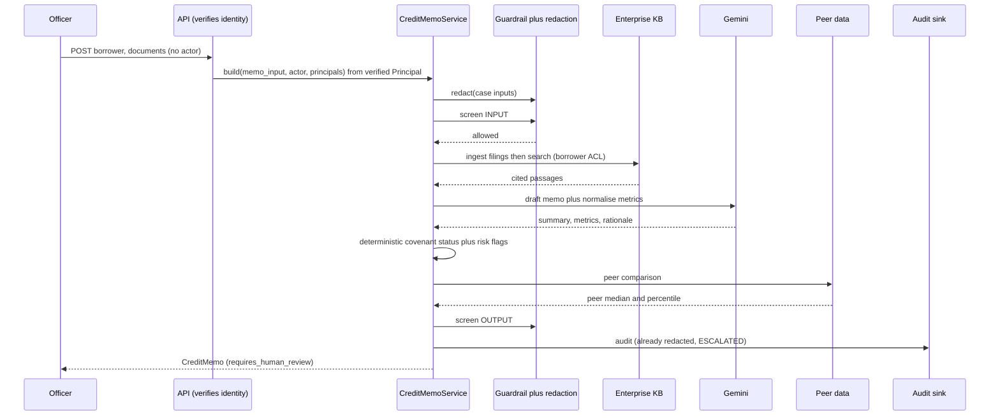

# `credit-memo-drafting` Credit-Memo / Underwriting Assistant

**Industries:** Banking & commercial lending, Fintech / lending, Private credit, Insurance, Commercial real estate

A grounded underwriting assistant for a commercial bank's credit team. From a borrower's
financial statements and filings it produces a **cited credit memo**, extracts
**covenants** (with a deterministic compliance status), raises **risk flags**, and
assembles **peer comparisons**. It is decision SUPPORT for a credit officer, **not a
credit decision**: every memo is maker-checker gated and always requires human review.

Built ports-and-adapters (hexagonal) on the **Gemini Enterprise Agent Platform**
(formerly Vertex AI), region-pinned to `asia-southeast1` (Singapore) for data residency.
The same domain core runs against the managed GCP stack, a fully offline local stack, the
shared platform services, or an on-premise stack, selected by one `profile` switch.

- Catalog id: `credit-memo-drafting` · group `doc` · priority **P1** · buyer: Credit / Commercial Banking
- Python package: `credit_memo` · CLI: `credit-memo` · service port: `8093`
- Profile env var: `CREDIT_MEMO_PROFILE` (`gcp` | `local` | `platform` | `onprem`)
  - `gcp`: Google Cloud managed services (lazy SDK imports).
  - `local`: a WORKING offline stack (SQLite FTS5 retrieval, a deterministic LLM, regex
    DLP, a heuristic guardrail, append-only local audit). SDK-free, no API key, no
    emulator. The dev / test default; runs the whole memo pipeline end to end.
  - `platform`: thin HTTP clients to the shared `agent-guardrail-gateway`, `enterprise-knowledge-base`, `agent-registry`, `model-quality-gate`, `agent-observability` services.
  - `onprem`: fail-fast Google Distributed Cloud migration placeholders.

## What it produces (four cited artifacts)

1. **CreditMemo**: borrower overview, financial analysis, covenant section, risk
   assessment, peer comparison, and a recommendation rationale (decision-support, never a
   decision). `requires_human_review=True`.
2. **Covenant[]**: extracted from filings/agreements (type, threshold + operator, current
   value, status `COMPLIANT` | `AT_RISK` | `BREACH`, citations). Status is computed
   deterministically; the LLM never overrides a breach.
3. **RiskFlag[]**: identified risks (category, severity, detail, citations).
4. **PeerComparison**: borrower metrics versus a peer set (from BigQuery), with the peer
   median, percentile, and deltas.

## Architecture at a glance

```mermaid
flowchart LR
  officer["Credit officer"] --> api["FastAPI + CLI + ADK agent"]
  api --> svc["CreditMemoService (domain core)"]
  subgraph safety["`agent-guardrail-gateway` safety pipeline (rule R1)"]
    redact["PII redaction"]
    guard["Guardrail screen"]
  end
  svc --> safety
  svc --> ports["Ports (Protocols)"]
  ports --> extract["DocumentExtractionPort"]
  ports --> kb["KnowledgeBaseClientPort (`enterprise-knowledge-base`)"]
  ports --> peers["PeerDataPort (BigQuery)"]
  ports --> llm["LLMPort (Gemini)"]
  ports --> obs["Audit + Tracer (`agent-observability`)"]
  extract --> docai["Document AI"]
  kb --> a2["`enterprise-knowledge-base`"]
  peers --> bq["BigQuery peer dataset"]
  llm --> gemini["Gemini 3.5 Flash"]
  obs --> worm["Cloud Logging WORM bucket"]
```

## The build pipeline (R1 full safety, audited)



## Quickstart (offline, no Google Cloud SDK)

```bash
python3.12 -m venv .venv && . .venv/bin/activate
pip install -e ".[dev]"          # core + dev tooling only, no google-cloud-*
export CREDIT_MEMO_PROFILE=local

ruff check src tests             # lint
ruff format --check src tests    # format check
pytest -m 'not integration' -q   # unit + contract tests
python eval/run_eval.py          # `model-quality-gate` promotion eval gate
```

## Run locally (a real cited memo, fully offline)

Under the `local` profile the whole pipeline runs on a laptop with no Google Cloud, no API
key, and no emulator: retrieval is SQLite FTS5 over a small built-in synthetic corpus, the
LLM is a deterministic schema-driven generator, redaction is regex DLP, and audit is an
append-only local store. The knowledge base self-seeds, so no separate ingest step is
needed for the smoke run:

```bash
export CREDIT_MEMO_PROFILE=local
credit-memo build "Acme Manufacturing Pte Ltd" --sector manufacturing --jurisdiction SG
```

This prints a real `CreditMemo`: a grounded summary, normalised metrics, two covenants with
a deterministic status, a cited risk flag, peer comparisons, and page-level citations
(`[doc-financials, filing p.4]` and friends), with the human-review banner. The local
stores default to `~/.credit_memo/`; set `CREDIT_MEMO_LOCAL_DB=:memory:` and
`CREDIT_MEMO_LOCAL_AUDIT=:memory:` for an ephemeral run.

Optional higher-fidelity local: set `FIRESTORE_EMULATOR_HOST` (with the `[gcp]` extra
installed) to back the in-process registry with Google's Firestore emulator. The google
client is imported lazily, only on that branch, so the default local path stays SDK-free.

Switching `CREDIT_MEMO_PROFILE=onprem` rebinds every port to the fail-fast migration
placeholders: the same command then exits `2` with a clear migration message, proving the
domain is unchanged and the on-prem path is the documented exit. The CLI and API are
import-safe with no GCP SDK installed. Install the managed stack with
`pip install -e ".[gcp,dev]"`.

```bash
credit-memo build "Acme Manufacturing Pte Ltd" --sector manufacturing --jurisdiction SG
credit-memo covenants "Acme Manufacturing Pte Ltd" --sector manufacturing
credit-memo serve --port 8093
```

## HTTP API

| Method | Path | Purpose |
| --- | --- | --- |
| POST | `/v1/credit-memo` | Build a full cited credit memo for a borrower |
| POST | `/v1/covenants` | Extract covenants (with tested status) from documents |
| POST | `/v1/risk-flags` | Identify risk flags for a borrower |
| GET | `/v1/personas` | List seeded dev personas for the picker (local profile only) |
| GET | `/healthz` | Liveness/readiness (reports profile and region) |
| GET | `/.well-known/agent-card.json` | A2A AgentCard for discovery (`agent-registry`) |

Identity is server-verified: no request carries an `actor`. In the `local` profile a
demo/test selects a seeded persona with the `X-Dev-Persona` header; secure (`gcp`/`platform`)
profiles verify the IAP-injected assertion. The verified `Principal` supplies the audit actor
and the entitlement principals fed into governed retrieval. The UI embeds same-origin (base
path + embed mode) or runs standalone. See
[`docs/embedding-and-identity.md`](docs/embedding-and-identity.md).

## Dependencies (catalog matrix)

`credit-memo-drafting` consumes the shared platform services via `platform` HTTP-client adapters: `agent-guardrail-gateway`/redaction (R1), `enterprise-knowledge-base` governed RAG (R3), `agent-registry` (R4), `model-quality-gate` AI
quality eval gate (R5), `agent-observability`/audit (R2). Peer data is internal (BigQuery),
so it has no platform adapter.

See `SPEC.md` for the contract, `ARCHITECTURE.md` for the design, and `COMPLIANCE.md` for
the principle and rule mapping. All borrower data in this repo is fictional.

## Licence

Apache-2.0. See `LICENSE`.

## Cost and latency

Size this system's cost and latency with the shared interactive calculator: [**live**](https://portable-genai.github.io/cost-latency-calculator/calc/calculator.html?system=credit-memo-drafting) or the [in-repo page](cost-latency-calculator.html). The engine and the pricing book are maintained once in [cost-latency-calculator](https://github.com/portable-genai/cost-latency-calculator).

## Documentation authority

When documents differ, use this order: `SPEC.md` defines behavior, `ARCHITECTURE.md`
defines implementation structure, `COMPLIANCE.md` defines control evidence, and this
README explains operation and adoption. Lower-authority documents must link upward rather
than override a higher-authority contract.
